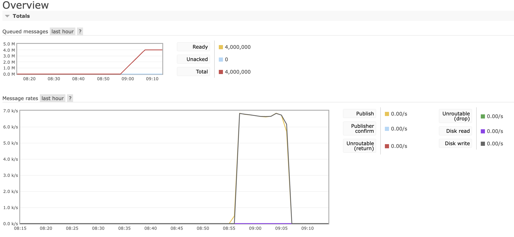
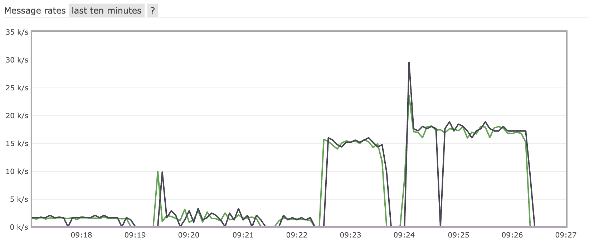

# Benchmarks

## Overview

This document offers a detailed analysis of various optimization strategies for RabbitMQ consumers. The aim is to assess the performance improvements achieved through each method.

## Benchmark Findings

> **Note**: The third peak on the benchmark image indicates an incorrect setup and should be ignored.

### Test 1: Individual Database Commits
- **Description**: Each message is committed to the database individually. This corresponds to the first peak on the benchmark image.
- **Result**: This is the least efficient approach.
- **Merge Request**: [View MR #8](https://github.com/Jakub-Kubik/cosmonaut_registry/pull/8)

### Test 3: Multi-threading with Individual Commits
- **Description**: Utilizes multi-threading and commits each message to the database individually. This is represented by the second peak on the benchmark image.
- **Result**: While faster than Test 1, the performance gain was not as significant as initially anticipated.
- **Merge Request**: [View MR #10](https://github.com/Jakub-Kubik/cosmonaut_registry/pull/10)

### Test 2: Bulk Database Commits
- **Description**: Messages are committed to the database in bulk, correlating with the fourth peak on the benchmark image.
- **Result**: This technique significantly improves message processing speed.
- **Merge Request**: [View MR #9](https://github.com/Jakub-Kubik/cosmonaut_registry/pull/9)

### Test 4: Multi-threading with Bulk Commits
- **Description**: Uses multi-threading and commits messages to the database in bulk, which is represented by the fifth peak on the benchmark image.
- **Result**: This is the most efficient method, although the difference in speed compared to Test 3 is marginal.
- **Merge Request**: [View MR #11](https://github.com/Jakub-Kubik/cosmonaut_registry/pull/11)

### Benchmark Images

## Conclusions

The code used in Test 4, which has proven to be the fastest, has been merged into the `main` branch.
